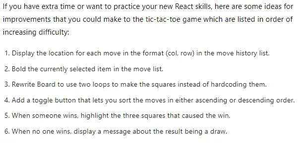
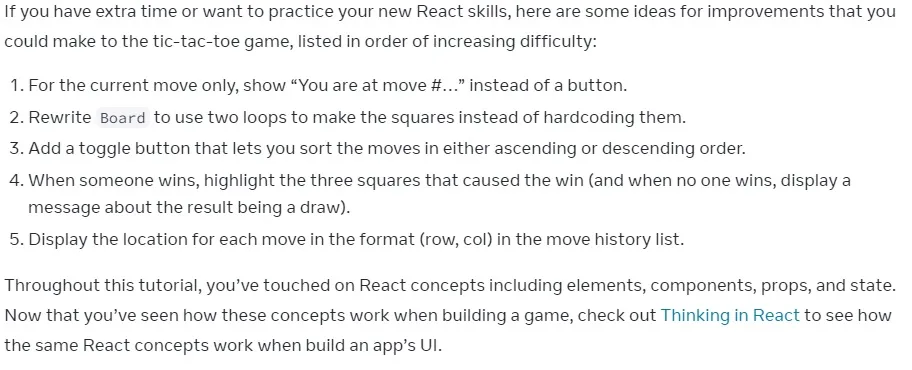
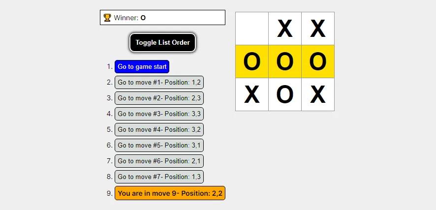
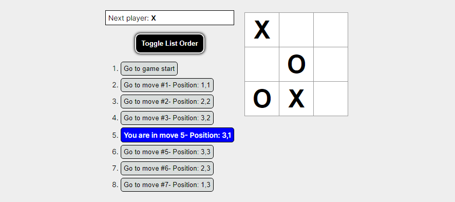
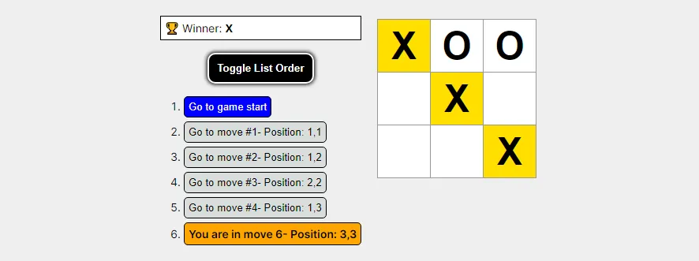
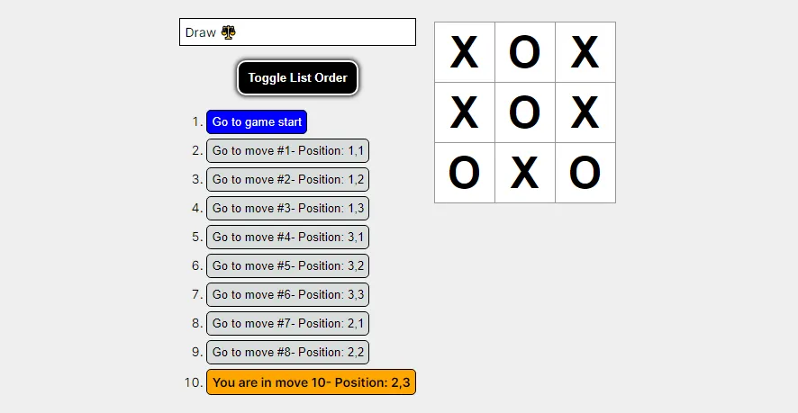

# Soluciones desafíos React Tutorial Legacy y Current Version

Este repositorio contiene el código con el cual resuelvo los desafíos adicionales dejados en el [Tutorial React versión Legacy](https://legacy.reactjs.org/tutorial/tutorial.html#wrapping-up) y [Tutorial React versión Current](https://react.dev/learn/tutorial-tic-tac-toe#wrapping-up) en los cuales se desarrolla el juego Tic Tac Toe. He realizado los desafíos semejantes en ambos tutoriales y además he realizado el primer desafío distinto y único que esta presente en el tutorial actual de React.

Los desafíos del tutorial versión **legacy** de React son los siguientes:



Los desafíos del tutorial versión **current** de React son los siguientes:



A continuación explico el código y muestro screenshots de lo implementado:

## Legacy React Tutorial: 1.Display the location for each move in the format (col, row) in the move history list

Para resolver esto he creado las dos funciones siguientes:

```js
function position(i) {
  const coord = [
    [1, 1],
    [1, 2],
    [1, 3],
    [2, 1],
    [2, 2],
    [2, 3],
    [3, 1],
    [3, 2],
    [3, 3],
  ];
  return coord[i];
}

export function indexElementDifferent(squarePrev, squareCurrent) {
  const indice = squareCurrent.findIndex(
    (elem, index) => elem !== squarePrev[index]
  );
  return position(indice);
}
```

Luego en el componente llamo a la función **indexElementDifferent** con el square del movimiento anterior y el square del movimiento actual:

```JSX
<button
  className={`${styles["button-list_time"]}
            ${
              this.state.indexSeleccionado == move
                ? styles["button-list-selected"]
                : undefined
            }`}
  onClick={() => this.jumpTo(move)}
>
  {desc}
  {move
    ? "- Position: " +
      indexElementDifferent(history[move - 1].squares, step.squares).join(",")
    : ""}
</button>
```

Con el código anterior muestro la posición en base a row y column donde se ha hecho la jugada. Solo se muestra para movimientos distintos del primero.



## Legacy React Tutorial: 2.Bold the currently selected item in the move list

Para realizar este ejercicio he creado un nueva propieda de estado llamada **indexSeleccionado** la cual inicialmente esta con valor null.

```js
this.state = {
  history: [
    {
      squares: Array(9).fill(null),
    },
  ],
  xIsNext: true,
  indexStep: 0,
  indexSeleccionado: null,
  toggleListPosition: true,
};
```

Cuando se ejecuta el método **jumpTo** al hacer click sobre algún elemento en la lista de movimientos, seteo dicha propiedad de estado **indexSeleccionado** al valor igual al índice de jugada realizada:

```js
jumpTo(step) {
    this.setState({
      indexSeleccionado: step,
      indexStep: step,
      xIsNext: step % 2 === 0,
    });
  }
```

Luego en los elementos de la lista aplico una clase de estilos para el elemento de la lista con índice igual al valor establecido en el valor de la propiedad de estado **indexSeleccionado**:

```js
const stylesButton =
  this.state.indexSeleccionado == move
    ? styles["button-list-selected"]
    : undefined;
```

A continuación muestro los estilos aplicados al elemento seleccionado en la lista:



## Legacy React Tutorial: 3.Rewrite Board to use two loops to make the squares instead of hardcoding them

Inicialmente se tiene el tablero creado de la siguiente manera:

```jsx
<div className="board-row">
          {this.renderSquare(0)}
          {this.renderSquare(1)}
          {this.renderSquare(2)}
        </div>
        <div className="board-row">
          {this.renderSquare(3)}
          {this.renderSquare(4)}
          {this.renderSquare(5)}
        </div>
        <div className="board-row">
          {this.renderSquare(6)}
          {this.renderSquare(7)}
          {this.renderSquare(8)}
        </div>
```

He creado dos loops utilizando el método **map** que generan dicho tablero:

```jsx
[0, 1, 2].map((i) => (
  <div key={i} className={styles["board-row"]}>
    {[0, 1, 2].map((j) => this.renderSquare(j + 3 * i))}
  </div>
));
```

## Legacy React Tutorial: 4.Add a toggle button that lets you sort the moves in either ascending or descending order

Para resolver este ejercicio he creado una nueva propiedad de estado llamada **toggleListPosition** con valor inicial igual a **true**:

```js
this.state = {
  history: [
    {
      squares: Array(9).fill(null),
    },
  ],
  xIsNext: true,
  indexStep: 0,
  indexSeleccionado: null,
  toggleListPosition: true,
};
```

Luego creo el método **handleToggleList** que se ejecuta cuando se hace click en el botón creado para cambiar de orden la lista. Dicho método alterna de valor booleano el valor de la propiedad de estado **toggleListPosition**:

```js
handleToggleList() {
    this.setState({
      toggleListPosition: !this.state.toggleListPosition,
    });
  }
```

```jsx
<button
  className={styles["button-toggle"]}
  onClick={() => this.handleToggleList()}
>
  Toggle List Order
</button>
```

Por último, procedo a cambiar de orden los números de la lista en el atributo **reversed** en función del valor booleano de la propiedad de estado **toggleListPosition**:

```jsx
<ol
  reversed={!this.state.toggleListPosition}
  className={styles["container-time-list"]}
>
  {this.state.toggleListPosition ? moves : moves.reverse()}
</ol>
```

El resultado de hacer click en el botón para realizar cambio de orden de la lista de movimientos es el siguiente:


## Legacy React Tutorial: 5.When someone wins, highlight the three squares that caused the win

He creado la función **squaresPositionWinner** la cual recibe como parámetro el array con los strings en el tablero que representan la jugada hecha cuando existe un ganador y retorna los índices que corresponden al string que gano el juego ya sea 'X' ó 'O':

```js
const lines = [
  [0, 1, 2],
  [3, 4, 5],
  [6, 7, 8],
  [0, 3, 6],
  [1, 4, 7],
  [2, 5, 8],
  [0, 4, 8],
  [2, 4, 6],
];
export function squaresPositionWinner(squares) {
  for (let i = 0; i < lines.length; i++) {
    const [a, b, c] = lines[i];
    if (squares[a] && squares[a] === squares[b] && squares[a] === squares[c]) {
      return [a, b, c];
    }
  }
}
```

Como el array de squares que representan cada jugada se encuentra en el componente root o padre llamado **Game** procedo a enviar como props dicho squares que representa la jugada cuando existe ganador de modo que dicho array llegue al componente **Square**. Además, hago envío a dicho componente el índice que representa a cada **Square**. Cuando existe un ganador, comparo el índice del Square con el índice de la posición ganadora y si son iguales pongo un color de fondo igual a #FFDF00 y en caso contrario pongo un color de fondo igual a blanco:

```jsx
function Square(props) {
  return (
    <button
      style={
        props.winner &&
        squaresPositionWinner(props.winner).includes(props.position)
          ? { backgroundColor: "#FFDF00" }
          : { backgroundColor: "white" }
      }
      className={styles.square}
      onClick={props.onClick}
    >
      {props.value}
    </button>
  );
}
```

A continuación muestro la imagen con ganador igual a X:



A continuación muestro la imagen con ganador igual a :


## Legacy React Tutorial: 6.When no one wins, display a message about the result being a draw

Cuando no existe ganador y no se pueden realizar más movimientos, entonces aquello implica que **TODAS** las posiciones del array **squares** poseen algún elemento distinto de null y dicho array debería ser de largo 9. Lo anterior lo implemento en el primer **if** que se encuentra dentro del primer **else** en el siguiente código:

```js
if (winner) {
  status = "🏆 Winner: " + `<strong>${winner}</strong>`;
} else {
  if (current.squares.filter((e) => e).length == 9) {
    status = "Draw ⚖️";
  } else {
    status =
      "Next player: " +
      (this.state.xIsNext ? "<strong>X</strong>" : "<strong>O</strong>");
  }
}
```

A continuación muestro cuando existe un empate:



## Current React Tutorial: 1.For the current move only, show “You are at move #…” instead of a button

La propiedad de estado **indexStep** se setea a un nuevo valor en dos ocasiones:

1-Cuando se hace click en algún item de la lista de movimientos

2-Cuando se realiza alguna jugada en el tablero

Por lo tanto, utilizando dicha propiedad de estado mostraré un tag div con estilos en reemplazo de un botón en la lista con el texto **You are in move #** en el índice de la lista igual al valor de la propiedad de estado **indexStep**:

```jsx
const stylesButton =
  this.state.indexSeleccionado == move
    ? styles["button-list-selected"]
    : undefined;
return (
  <li key={move}>
    {move == this.state.indexStep ? (
      <div
        className={`${styles["actual-list-time"]}
            ${stylesButton}`}
        onClick={() => this.jumpTo(move)}
      >
        You are in move {move + 1}
        {move
          ? "- Position: " +
            indexElementDifferent(history[move - 1].squares, step.squares).join(
              ","
            )
          : ""}
      </div>
    ) : (
      <button
        className={`${styles["button-list_time"]}
            ${stylesButton}`}
        onClick={() => this.jumpTo(move)}
      >
        {desc}
        {move
          ? "- Position: " +
            indexElementDifferent(history[move - 1].squares, step.squares).join(
              ","
            )
          : ""}
      </button>
    )}
  </li>
);
```

Cuando se hace click en algún elemento de la lista se aplican estilos para esa acción en base a lo realizado en mi solución del ejercicio dos del tutorial legacy y además se aplican estilos en base a lo realizado en el ejercicio actual lo que provoca que existan **2** estilos aplicados a la vez. En este caso se aplican los estilos establecidos por cascada en CSS:

```css
.actual-list-time {
  padding: 5px;
  background-color: orange;
  border: 1px solid black;
  cursor: pointer;
  border-radius: 5px;
  font-weight: 600;
}
.button-list-selected {
  background-color: blue;
  color: white;
}
```

Es decir, cuando existan las dos clases en el mismo elemento la que primará será la última clase que en este caso es la clase **button-list-selected**.


